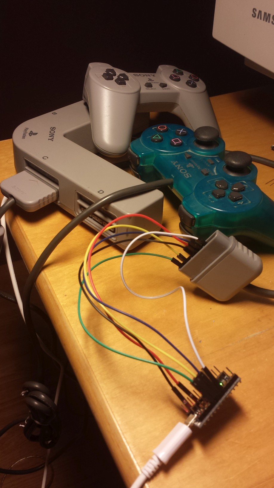

## Sony Playstation

## What do I need?
- You will need one [Atmega32u4](https://pt.aliexpress.com/item/New-Pro-Micro-ATmega32U4-5V-16MHz-Module-with-2-row-pin-header-For-Leonardo-best-quality/32273120508.html?spm=2114.13010608.0.0.Uv843y&detailNewVersion=&categoryId=400103) (e.g. Arduino Leonardo).

## Wiring the Controller
As the following picture from the [amazing CuriousInventor PS2 Interface Guide](https://store.curiousinventor.com/guides/PS2) shows, PlayStation controllers use 9 pins:

| Pin # | Signal      | Direction                 | Notes          |
|-------|-------------|---------------------------|----------------|
| 1     | Data        | Controller -> PlayStation | Open Collector |
| 2     | Command     | PlayStation -> Controller |                |
| 3     | Motor Power |                           | 7.5V           |
| 4     | Ground      |                           |                |
| 5     | Power       |                           | 3.6V           |
| 6     | Attention   | PlayStation -> Controller |                |
| 7     | Clock       | PlayStation -> Controller |                |
| 8     | (Unknown)   |                           |                |
| 9     | Acknowledge | Controller -> PlayStation | Open Collector |

**You are advised not to rely on wire colors, but rather on pin positions**. The wires in the image come from an official Sony controller, I expect their colors to be fairly consistent among all Sony controllers, but you shouldn't really trust them.

-- documentation taken from https://github.com/SukkoPera/PsxNewLib
